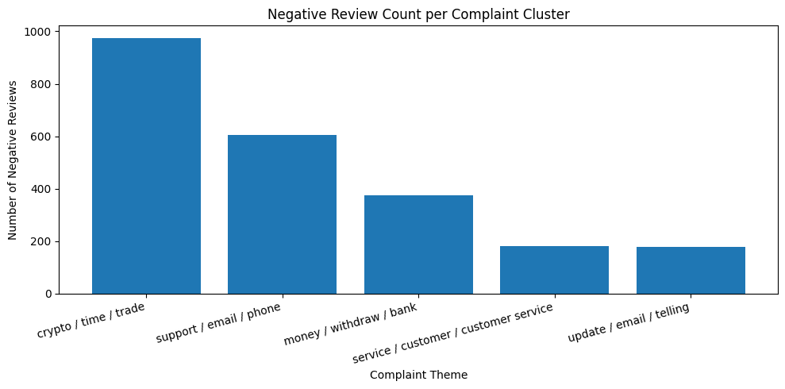
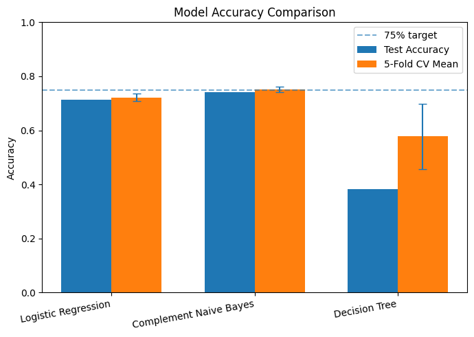
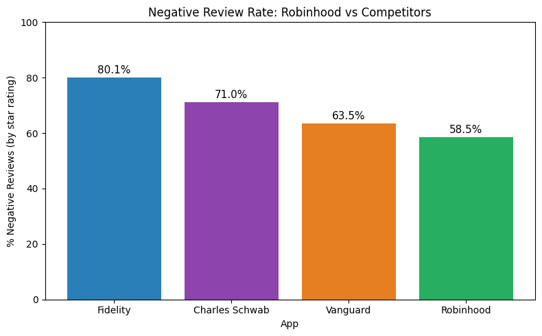

# Customer Feedback Intelligence Pipeline

> **Presentation:** [YouTube demo](https://google.com)

## Overview
The **Customer Feedback Intelligence Pipeline** is a data science system that analyzes large volumes of customer reviews for the **Robinhood** mobile application to extract useful business insights. The machine learning pipeline converts raw customer app store reviews into structured insights, identifying complaint themes, classifying sentiment, and ranking product pain points. Trained on Robinhood reviews and competitor analysis with Fidelity, Charles Schwab, and Vanguard.

## Problem Statement

Companies receive thousands of customer reviews, support tickets, and feedback comments. Manually reading and summarizing this feedback is time-consuming and often leads to missed trends, delayed responses to issues.

Goal: Successfully identify the top 5 most frequently occurring complaint themes in Robinhood app store reviews, and classify review sentiment (positive/negative/neutral) with at least 75% accuracy, allowing product teams to prioritize which pain points to address.


---
## How to Run

### Prerequisites
- Python 3.10+
- Google Colab (recommended) or Jupyter Notebook

### Installation

```bash
make install
```

or 

``` pip install app-store-web-scraper google-play-scraper langdetect scikit-learn pandas matplotlib seaborn contractions ```

### Running the Pipeline
Open `reviews_radar_notebook.ipynb` in Google Colab and run all cells from the top. Each section is labeled and can be run independently after the data collection cells have been ran.

The notebook will:
1. Scrape reviews from the App Store and Google Play
2. Combine, clean and save the data as `robinhood_reviews_cleaned.csv`
3. Generate and save all EDA visualizations
4. Train and evaluate models
5. Apply the pipeline to competitor apps

### Run tests
 
```bash
make test
```

This runs `tests/test_pipeline.py` using pytest, which tests the core pipeline functions.

## Repository Structure
 
```
├── reviews_radar_notebook.ipynb  # Full pipeline notebook
├── README.md                     
├── Makefile                      # Install, run, and test commands
├── robinhood_reviews_cleaned.csv # Cleaned dataset 
├── model_metadata.json           # Cluster labels, class names, vocab size
├── models                        # Saved fitted models
├── figures/                      # All saved visualizations
├── tests/
│   └── test_pipeline.py          # Test suite
└── .github/
    └── workflows/
        └── test.yml              # GitHub Actions CI workflow
```

### Current Data Sources

| Source | Library | Reviews Collected | Notes |
|--------|---------|-------------------|-------|
| Apple App Store (US) | `app-store-web-scraper` | ~500 | Apple's public API caps at 500 reviews per country |
| Apple App Store (GB) | `app-store-web-scraper` | ~100 | Stopped early due to API returning bad entries |
| Google Play Store (US) | `google-play-scraper` | ~5,000 |  |
| **Total (after cleaning)** | | **~3,957** | After non-English removal |

### Why two sources?
 
Apple's API caps at ~500 reviews per country regardless of how many are requested. Adding the GB endpoint and Google Play compensates for this and gives better coverage. The dataset skews about 85% Android as a result (limitation).

### Data Fields Collected
- `review` - raw review text
- `rating` - star rating (1–5)
- `date` - review submission date
- `title` - review title
- `country` - country code or 'google_play'
- `sentiment` - derived label (negative/neutral/positive)
- `source` - 'App Store' or 'Google Play'

---

## Visualizations

| Visualization | Insight |
|--------------|---------|
| Rating Distribution | Heavily skewed; most reviews are 1-star or 5-star, fewer in betweens |
| Sentiment Distribution | More negative than positive reviews in general |
| Review Length Distribution | Most reviews are short (under 200 characters) |
| Avg Review Length by Sentiment | Negative reviews tend to be longer since users write more when complaining |
| Review Volume by Source | ~85% Google Play, ~15% App Store; dataset skews toward Android users |
| Average Rating Over Time | Ratings trending downward from ~3.5 in May 2024 to ~2.0-2.5 in early 2026 |
| Review Volume Over Time | Low App Store volume causes misleading spikes in early period |

---

## Data Processing

### Cleaning Steps
1. **Remove duplication** — removed duplicate reviews using exact text match
2. **Non-English removal** — used `langdetect` to filter non-English reviews; and reviews shorter than 20-30 characters were kept because of reliability
3. **Text normalization** — lowercased all text, removed numbers and punctuation using regular expression
4. **Stop word removal** — handled using sklearn's `ENGLISH_STOP_WORDS` plus domain specific stopwords added
5. **Contraction expansion** — using `contractions.fix()` method, converting "can't" to "cannot" ensuring consistent vocabulary

**Result:** 3,957 reviews ready for feature extraction.

---

## Feature Extraction (TF-IDF)

Reviews are converted to numerical vectors using TF-IDF. Key parameters:

**Parameters:**
- `max_features=2000` - Top 2,000 terms by TF-IDF score
- `ngram_range=(1,2)` — captures single words and two-word phrases (e.g. "customer service")
- `min_df=5` — a term must appear in at least 5 reviews to be included
- `max_df=0.85` — terms in > 85% of reviews are too common to discriminate between topics
- `sublinear_tf=True` — replaces raw frequency with 1 + log(freq) to reduce the impact of very common terms
- `stop_words` - sklearn defaults + manually added and domain specific terms (robinhood, stock, market, trading, etc.)

**Result:** TF-IDF matrix of shape (3957, 1862) — 3957 reviews × 1862 features

---

## Dimensionality Reduction (LSA)

Before clustering, TF-IDF features are reduced using **Latent Semantic Analysis (LSA)** via `TruncatedSVD` becuase K-Means makes spherical clusters with Euclidean distance, but text data in a high-dimensional TF-IDF space is sparse and not spherical.

- `n_components=20` was chosen after experimenting; produced better silhouette scores than 50

**Result:** Reduced matrix of shape (3,957 × 20)

---

## Challenges Faced

1. **Unbalanced data volume by source**: 85% Google Play, 11% App Store. Results dont full represent IOS users
2. **Apple API cap**- the app store scraper API limits to 500 reviews per country (10 pages × 50 reviews), regardless of how many are requested
3. **Neutral class is small**: only ~300 neutral reviews/3 star rating
4. **Silhouette scores are low**: due to high dimensionality and sparse overlap between topics. LSA improved scores significantly (from ~0.02 to ~0.18) but did not reach the 0.30 target
5. **Recent data only**: Older complaints or long-term trends are not captured covers; mid 2024 – March 2026.

---


## Project Goals

| # | Goal | Metrics |
|---|------|------------------------|
| 1 | Identify the top 5 recurring complaint themes (pain point) | K-Means clustering with silhouette score > 0.30 if possible |
| 2 | Classify review sentiment (positive / negative / neutral) | Logistic Regression with > 75% accuracy |
| 3 | Rank pain points by frequency | Frequency count of reviews per cluster |
| 4 | Distinguish features by rating | Compare most common terms in 1–2 star vs. 4–5 star reviews |

**If data is limited:** a Kaggle review dataset would be used instead (like [Amazon product reviews](https://www.kaggle.com/datasets/snap/amazon-fine-food-reviews)) using the same pipeline.


## Model Training & Evaluation
 
### Clustering (K-Means)
 
Clustering was applied only to negative reviews. The goal is complaint themes and clustering all reviews produces clusters that mix positive and negative sentiment, which is not useful for pain point analysis.
 
**Silhouette scores by k:**
 
| k | Silhouette Score |
|---|-----------------|
| 3 | 0.1090 |
| 4 | 0.1322 |
| **5** | **0.1610** (chosen) |
| 6 | 0.1691 |
| 10 | 0.2149 |
 
k=5 was chosen to match the project goal of 5 complaint themes. Scores rise gradually with no clear elbow- the low scores are a data property 
 
Cluster labels were assigned by inspecting each cluster's top 12 TF-IDF terms and reading sample reviews per cluster.



### Sentiment Classification
 
Sentiment labels were derived from star ratings (no manual annotation required):
- 1–2 stars -> negative
- 3 stars -> neutral
- 4–5 stars -> positive
Three classifiers were compared on the same TF-IDF features:
 
| Model | Test Accuracy | CV Mean | CV Std |
|-------|--------------|---------|--------|
| Logistic Regression | 71.2%  | 72.2% | ±1.4% |
| **Complement Naive Bayes** | **74.2%** | **75.2%** | **±1.1%** |
| Decision Tree | 38.3% | 57.8% | ±12.1% |
 


**75% target:** Met by Complement Naive Bayes (CNB) -> (74.2% test, 75.2% CV).
 
**CNB wins:** CNB models each class by learning from all other classes combined, making it more robust on the imbalanced dataset (only 249 neutral reviews vs 1,844 negative). 
 
**Why Decision Tree fails:** Decision Trees split the feature space one variable at a time. With 1,862 features and max_depth=15, it can only make 15 splits which is not enough to learn generalizable boundaries in high-dimensional sparse text space.
  
### Evaluation Strategy
 
- 80/20 train-test split (`test_size=0.2`, `random_state=42`)
- 5 fold cross-validation on full dataset to confirm stability
- Confusion matrix for per-class breakdown
- Classification report (precision, recall, F1 per class)
---
 
### Key Findings
 
- **Trading & Options is the dominant pain point**— cluster 0 mentions execution, fills, options features, crypto, or pricing
- **Rating trend is declining**- Google Play average fell from ~3.4 (May 2024) to ~1.6 (April 2026); the worst single-month drop was -2.67 stars in November 2024
- **Poor app quality is industry-wide** — Fidelity has a lower average rating (1.75) than Robinhood (2.51) despite being a larger company



---

## Visualizations
 
All visualizations are saved in the `figures/` folder.
 
| File | What it shows |
|------|---------------|
| `figures/cluster_frequency.png` | Negative review count per complaint cluster |
| `figures/confusion_matrix_lr.png` | Logistic Regression 3-class confusion matrix |
| `figures/confusion_matrix_best_model.png` | Complement Naive Bayes confusion matrix |
| `figures/model_accuracy.png` | Test accuracy and 5 fold CV comparison across all three models |
| `figures/lsa_variance.png` | Cumulative explained variance by number of LSA components |
| `figures/tfidf_top_terms.png` | Top 20 TFIDF terms across all reviews |
| `figures/competitor_neg_rate.png` | Negative review rate: Robinhood vs. Fidelity, Schwab, Vanguard |
 
---
 
## Limitations
 
1. **85% Android data** — iOS complaints may differ; Apple's API cap prevents a representative iOS sample
2. **Low silhouette scores** — complaint text has overlapping vocabulary across topics
3. **The neutral class underperforms** — 304 neutral reviews (7.7%) is not enough for reliable 3 class boundaries
4. **Competitor vocabulary gap** — TF-IDF trained on Robinhood reviews so competitor-specific terms are out of vocabulary 
---


## Dataset

### Primary Data Source

-  **App Store reviews for Robinhood** scraped using the [app-store-web-scraper](https://pypi.org/project/app-store-web-scraper/) Python library (no API key neded)
  - Target: ~5,000–10,000 English reviews
  - Fields collected: review text, star rating, review date, review title
  - No API key or authentication required
- Amazon product review datasets (Kaggle as fallback)

### Data Collection

Primary method:

* `app-store-web-scraper` Python library (for App Store data)

```python
from app_store_web_scraper import AppStore

app = AppStoreEntry(app_id=938003185, country="us")
```

---


## How to Test
 
```bash
make test
```
 
The test suite covers:
- `get_sentiment()` — label mapping for all 5 star ratings
- `clean_text()` — number removal, lowercasing, punctuation removal, whitespace normalization
- Google Play scraper — smoke test confirming the scraper reaches the API and returns reviews with expected fields

Tests are also run automatically on every push via GitHub Actions (`.github/workflows/test.yml`).
 
---

## Stretch goals 
- [ ] Multi-app comparison analysis
- [ ] Real-time monitoring of new App Store reviews
- [ ] Interactive dashboard front-end
- [ ] Advanced topic modeling methods
